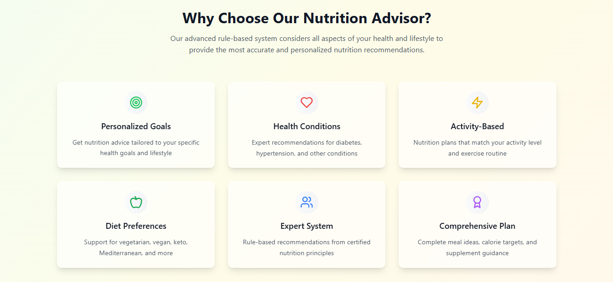
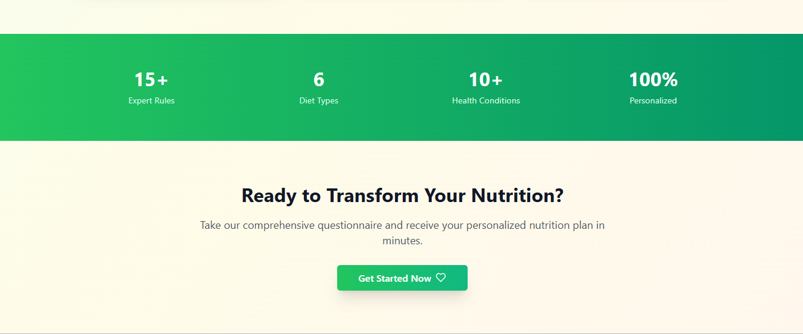
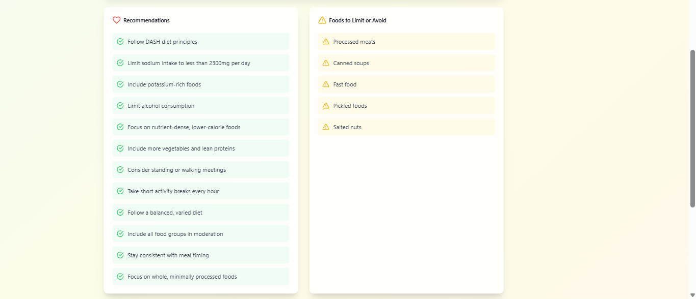
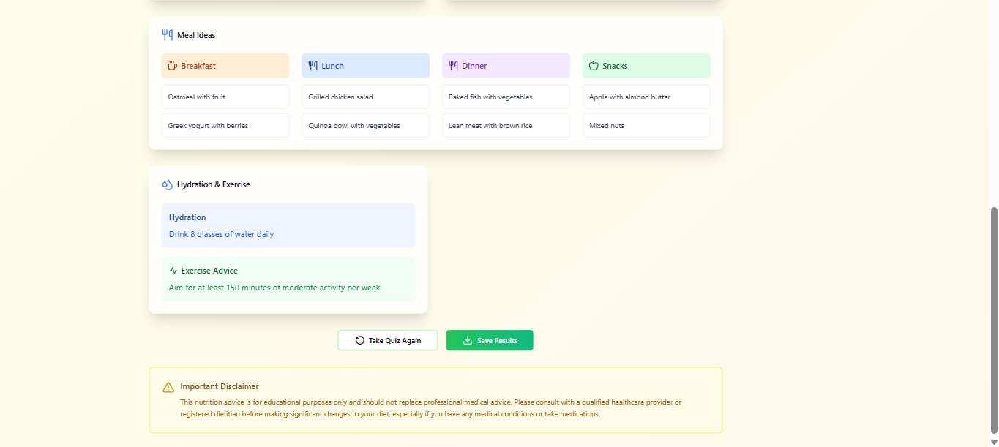

<p align="center">
  
</p>

# NutritionAdvisor

<p align="center">
  <a href="https://vercel.com/"></a>
  
  
  
</p>

NutritionAdvisor is a beautiful, interactive, and fully rule-based expert system for personalized nutrition advice. Built with React, TailwindCSS, shadcn/ui, Framer Motion, and lucide-react, this app guides users through a multi-step questionnaire and delivers expert recommendations tailored to their health goals, lifestyle, and dietary preferences.


## 🚀 Features

- **Step-by-step Nutrition Quiz:** Age, gender, activity level, health goals, dietary preferences, medical conditions, and eating habits
- **Rule-Based Inference Engine:** 15+ clear, domain-specific rules for nutrition advice, implemented in TypeScript
- **Personalized Results:**
  - Daily calorie target range
  - Balanced plate macro ratios
  - Actionable recommendations
  - Foods to avoid
  - Simple meal ideas (breakfast, lunch, dinner, snacks)
- **Modern UI/UX:**
  - Soft, healthy color palette
  - Animated transitions (Framer Motion)
  - Progress bars, card flip effects, subtle hover states
  - Responsive design for mobile and desktop
  - Beautiful results cards with food icons (🥦 🥩 🍞 🍎)
- **State Management:** React Context API
- **Restart & Retake Quiz:** Users can retake the quiz anytime
- **Ready for Deployment:** Easily host on Vercel or similar platforms


## 🛠️ Tech Stack

- **Frontend:** React, TypeScript, TailwindCSS, Framer Motion, shadcn/ui, lucide-react
- **State Management:** React Context API
- **Backend:** (Optional) Node.js/Express or Python/Flask/FastAPI for server-side inference or data persistence
- **Deployment:** Vercel (recommended)


## 📦 Getting Started

### 1. Clone the Repository

```bash
git clone https://github.com/Buzz-brain/nutritionadvisor.git
cd nutritionadvisor
```

### 2. Install Dependencies

```bash
npm install
```

### 3. Run Locally

```bash
npm start
```

Open [http://localhost:3000](http://localhost:3000) to view the app in your browser.

### 4. Deploy to Vercel

- Push your code to GitHub
- Go to [Vercel](https://vercel.com/) and import your repository
- Follow the prompts to deploy (Vercel auto-detects React/Vite projects)


## 📁 Project Structure

```text
├── src/
│   ├── components/         # UI components (Landing, Quiz, Results, UI)
│   ├── context/            # Nutrition context provider
│   ├── lib/                # Utility functions
│   ├── types/              # TypeScript types
│   ├── utils/              # Rule-based expert system logic
│   ├── App.tsx             # Main app component
│   ├── main.tsx            # Entry point
│   └── index.css           # Global styles
├── public/
├── assets/                 # Screenshots, logo, banners
├── package.json
├── tailwind.config.js
├── postcss.config.js
├── vite.config.ts
└── README.md
```


## 🧠 Rule-Based Expert System

All nutrition logic is implemented in [`src/utils/nutritionRules.ts`](src/utils/nutritionRules.ts) as a set of clear, maintainable rules. The NutritionAdvisor inference engine applies forward chaining to generate advice based on user answers.


## 🎨 UI Preview


**Landing Page**




**Quiz Flow**


**Results Cards 1**


**Results Cards 2**


**Results Cards 3**


**Print Modal**


## ✨ Customization

- Add new rules or modify existing ones in `nutritionRules.ts`
- Update UI components for new features or branding
- Integrate a backend for user history or advanced analytics (optional)


## 📄 License

This project is licensed under the MIT License.


## 🙏 Credits

- UI components: [shadcn/ui](https://ui.shadcn.com/)
- Icons: [lucide-react](https://lucide.dev/)
- Animations: [Framer Motion](https://www.framer.com/motion/)

---

**Impress your users and evaluators with NutritionAdvisor, a world-class, interactive nutrition expert system!**
